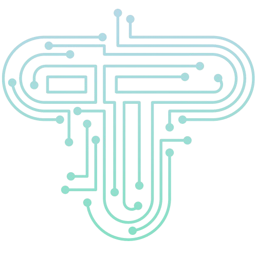

<p align="center">

</p>

# Itty Bitty
## A URL Shortener Web Application created with Laravel, Vue and Inertia.js

Welcome to the URL Shortener project! This project is a web application built using Laravel, Vue.js, and Inertia.js. It allows users to shorten URLs, manage their shortened URLs, and view analytics on URL clicks. Users must be registered and logged in to use the URL shortening service.


## Table of Contents 📖

- [Tecnologies Used](#tecnologies)
- [Features](#features)
- [Installation](#installation)
- [Usage](#usage)
- [Project Structure](#project-structure)

## Technologies Used 
-   **Laravel**  
-   **Vue.js**  
-   **Inertia.js**  
-   **Tailwind CSS**  
-   **SQLite**  

## Features
- **User Authentication:** Users can register, log in, and manage their profiles.
- **URL Shortening:** Authenticated users can shorten URLs.
- **URL Management:** Users can view and delete their shortened URLs.
- **Analytics:** Users can view click analytics for their shortened URLs.


## Installation  🖥️
To get started with this project, follow these steps:
1. **Clone the repository:**   
```git clone https://github.com/BiancaMesa/itty-bitty.git```
2. **Install dependencies:**  
```composer install```  
```npm install```
3. **Set up environment variables**  
```cp .env.example .env```
```php artisan key:generate```
4. **Configure your database in `.env` file:**  
    ```env
    DB_DATABASE=your_database
    DB_USERNAME=your_username
    DB_PASSWORD=your_password
    ```
5. **Run migrations:**  
```php artisan migrate```
6. **Build assets:**  
```npm run dev```
7. **Start the development server:**  
```php artisan serve```
8. **Access the application in your browser:**  
    ```
    http://localhost:8000
    ```


## Usage 🚀
1. **Register/Login:** Create a new account or log in with existing credentials.
2. **Shorten a URL:** Navigate to the dashboard and enter the original URL and a title to generate a shortened URL.
3. **Manage URLs:** View, copy, or delete your shortened URLs from the dashboard.
4. **View Analytics:** Access the analytics section to see the number of clicks each URL has received.


# Project Structure 🔭
The project has been vuilt using the Laravel starter kit with Vue.js and Inertia.js. 

## Backend 🗄️🔙
The database of choice for this project has been SQLite and TablePlus has been used as a tool to manage the databse.
For the project, two tables have been created in the database. One with the information of the user and another one with the information of the URLs: the original URL, the title, the shortened URL and its unique key, the number of clicks, and the user_id (which relates both tables). The relation between those tables has been one to many, so one user can have many URLs but each URL is linked to one user. 

The URL Shortener project's routing setup includes various HTTP methods to handle different functionalities. The get route for the home (/) displays a welcome page with login and registration options. Authentication routes handle user login and registration. Authenticated routes are grouped with a middleware to ensure only logged-in users can access them. These routes include get requests for the dashboard (/dashboard), profile editing (/profile), URL management (/manage-urls), and analytics (/analytics). The post route on the dashboard allows users to create short URLs, while the patch and delete routes on the profile handle profile updates and deletions. There is also a delete route for removing short URLs (/short-url/{id}). Finally, a public get route handles redirection for shortened URLs (/{shortUrlKey}).

A regex has been included in form request to validate that the user puts a valid URL. 

## Frontend 👩🏼‍💻
In the frontend of the URL Shortener project, we utilized Inertia.js to render React components seamlessly within our Laravel application.  
The 'Welcome' component is rendered on the home page, displaying login and registration options based on the route's availability.
The 'Dashboard' component acts as the main hub for user interaction within the application. From this central dashboard, users can access three key functionalities: ShortenUrl.vue, ManageUrl.vue, and Analytics.vue.

- **'ShortenUrl' component:** This component is responsible for providing the form where users can input and submit URLs to be shortened. It handles POST requests to create new short URLs and displays any errors accordingly. 

- **'ManageUrl' component:** This component allows users to view and manage their existing shortened URLs. Users can see a list of their short URLs, and perform actions such as deleting individual URLs with DELETE requests.

- **'Analytics' component:** This component displays analytics and performance data for the shortened URLs. It provides users with insights into the number of clicks helping them track the effectiveness of their links.

These components are rendered conditionally within the Dashboard.vue, depending on the user’s interactions and navigation choices. This modular approach allows for a dynamic and responsive user interface, enhancing the overall user experience by integrating these functionalities seamlessly within a single-page application framework.